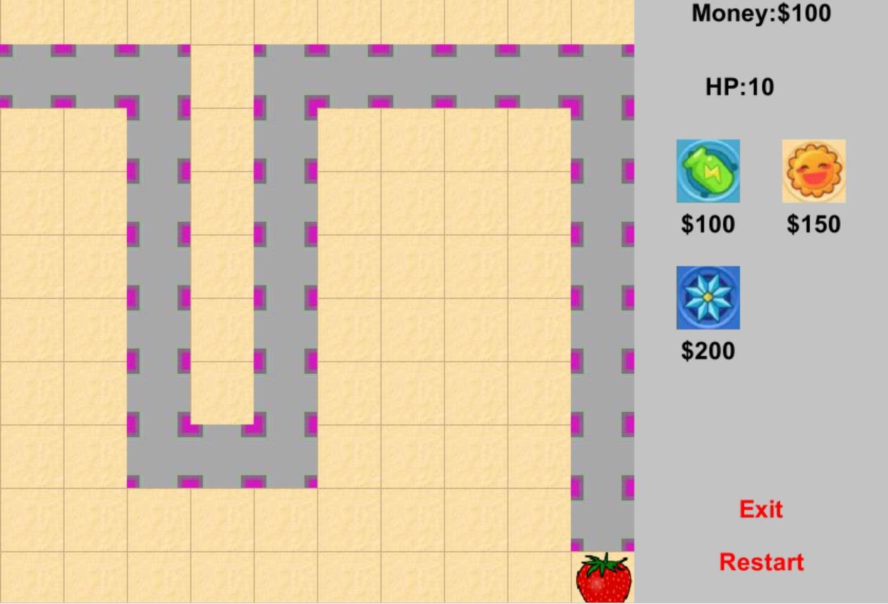

# overall
This game is developed using Greenfoot. Greenfoot is an educational Java integrated development environment that is perfect for creating small games. This game implements the complete tower defense game process, from difficulty selection to spending money to build towers, to several waves of monster invasions, and ultimately, victory or defeat. The map consists of 10x10 grids. Time is measured in frames, and locally, 1 second is approximately 60 frames. Several key scenes are shown in the figure.

  
  
Main menu

  
  
Beginner Scene

  
  
Intermediate Scene

  
  
Advanced Scene

# How to Play
This game is controlled entirely using the left mouse button. Please note that if the game is played in full screen, it may not be operable. Please keep the game in windowed mode.

To build a tower in the game scene, click on an empty area, and a blue prompt will appear there. Then, click on the desired tower in the menu on the right-hand side. If an invalid area is clicked or a tower is selected when there is not enough money, the selection will be considered invalid.

  

# Categories of towers
## Bottle Rocket Tower

  

When an enemy enters its range, the Bottle Rocket Tower will turn toward the enemy and fire a bullet. The tower can fire a bullet every 10 frames at most. The bullet deals 30 damage to the enemy upon contact.

## Sunflower

  

When an enemy enters its range, the Bottle Rocket Tower will create a flashing ring of fire. The ring appears for 4 frames every 20 frames and deals 10 damage per frame to any enemies within range.

## Snowflake

  

When an enemy enters its range, the Bottle Rocket Tower will create a flashing ring of ice. The ring appears for 4 frames every 20 frames and deals 1 damage per frame to any enemies within range. Additionally, the ring will slow down enemies and temporarily reduce their movement speed, turning them into turtles.

  

# Categories of monsters
## Common Enemy

  

The Regular Monster or Common Enemy has 100 hit points. When it reaches the target, it deals 1 damage, and when it dies, it provides 50 gold coins. If it enters a ring of ice, it will slow down and turn into a turtle.

  

## Boss

  
  
  

From left to right, there are the Beginner, Intermediate, and Advanced Bosses, with hit points of 2000, 5000, and 8000, respectively. The final boss appears alone in the last wave. Bosses are larger than regular monsters and are not affected by slowdown effects. When a boss reaches the end point, the game will immediately end in a Game Over.

# Program structure

This game was developed using Greenfoot, and all subclasses are derived from the World and Actor classes. The World class is responsible for creating the game scene and generating and destroying Actor objects. In addition, all other classes, including monsters, towers, UI buttons, text, and background music, inherit from the Actor class. The key method in both classes is act(), which runs in the background once per frame.

The game flow mainly involves the Enemy, Tower, Carrot, and Boss classes. 
The Enemy class includes methods for automatic pathfinding, taking damage from various towers, and dying. 
The Tower class is responsible for generating bullets or rings of fire or ice. 
The Carrot class is responsible for detecting game over conditions. 
The Boss class is similar to the Enemy class, but includes a victory condition.